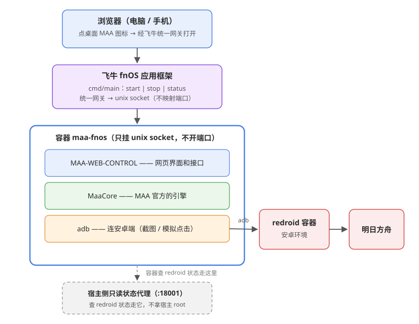

# MAA-FnOS

我一直在用 [MAA](https://github.com/MaaAssistantArknights/MaaAssistantArknights)（MaaAssistantArknights，明日方舟小助手）帮我挂日常。
它只有 Windows / macOS / Linux 的桌面版，而我的机器常年开着的是那台飞牛 NAS，
每次都得远程桌面连过去点一下，麻烦得很。

所以就动手把 MAA 搬到了飞牛上，做成一个可以直接装的应用。装完之后桌面上会多一个 **MAA** 图标，
点开是完整的网页控制台：配任务、看实时日志、定时收菜，手机浏览器打开也能用。

---

## 怎么装

1. 到 [Releases](https://github.com/mydanyi/MAA-FnOS/releases) 下载最新的 `maa-web-v*.fpk`
   （包里自带离线镜像，不用自己构建，也不用联网）
2. 打开飞牛 **应用中心**，点左下角的 **手动安装**
3. 选好存储空间，点 **从电脑上传**，把刚下载的 fpk 选上
   （fpk 已经在 NAS 上，就点 **从 NAS 添加**）
4. 装完在应用中心点启动，再点桌面上的 **MAA** 图标

地址是 `http://<NAS_IP>:18000/`。

出新版就用同样的方式再装一次新包。任务档案、日志、截图都存在
`/vol1/@appdata/maa-web/maa-data`，重装不会动它，想清空就自己删这个目录。

### 装之前要有什么

- 飞牛 fnOS 1.1.3100 以上，Docker 装好
- x86_64 架构的机器
- 一个能用的安卓环境。我用的是 redroid 容器，怎么起见下面的[安卓环境](#安卓环境redroid)；
  能被 `adb connect` 连上的真机或模拟器也都可以
- 大概 3GB 硬盘（镜像 1.15GB + 安装包 585MB + 运行数据）

## 用起来

1. **连安卓端**
   网页里进 *设置 → 连接*，ADB 地址填 redroid 的地址，比如 `<NAS_IP>:5555`。
   容器的 5555 端口记得映射到宿主上。
2. **触摸方式选 MaaTouch**
   比默认的 `adb shell input` 快也更稳，MAA 会自己把它推进安卓端拉起来。
3. **调任务档案**
   仓库里带的档案只是示例，关卡、基建换班、公招标签这些得按自己账号改。
   页面上 开始唤醒 / 自动公招 / 基建换班 / 理智作战 / 信用收支 / 领取奖励 这些开关按需打开就行。
4. **点运行**，然后去日志页看它干活。

> 在应用中心点停用，会先把进行中的任务链停干净，再停容器，不会拦腰砍断。

## 架构



简单说：MAA 的引擎、社区的网页前端、连安卓的 adb，装进一个 Docker 镜像，再包成飞牛的应用。
容器不拿宿主的 root 权限，查 redroid 状态走一个只读的小代理，功能有了、权限还是收着的。

## 安卓环境：redroid

MAA 得有个安卓端才能干活，我用的是容器化的安卓，镜像 `erstt/redroid:13.0.0_ndk_ChromeOS`（2.07GB）。

为什么不用官方的：明日方舟的新引擎把 x86 的 so 去掉了，纯 x86 的安卓镜像跑不起来；
ERSTT 这套补了 ARM 转译层，x86_64 的机器上也能跑。

我这边是一个 compose 起单容器：

```yaml
services:
  redroid:
    image: erstt/redroid:13.0.0_ndk_ChromeOS
    tty: true
    stdin_open: true
    privileged: true
    devices:
      - /dev/dri
      - /dev/binder
    ports:
      - 5555:5555
    volumes:
      - /path/to/redroid-cos13/data:/data
    command:
      - androidboot.redroid_gpu_mode=host
      - androidboot.use_memfd=1
```

几个要注意的点：

- `privileged: true` 和 `/dev/binder` 是 redroid 必需的；`/dev/dri` 是给 GPU 加速的
- **网络就用 Docker 默认的 `bridge`**（像上面这样不写 `networks:` 就行），别挂自定义网络——
  不然飞牛网页端远程传文件、手动安装应用会失败（实测踩过）
- `5555` 就是 MAA 里要填的 ADB 端口，所以填 `<NAS_IP>:5555`
- 容器名里带 `redroid` 就能自动认出来；名字里不带、或者机器上有好几个，
  就在**宿主**上给状态代理设 `MAA_REDROID_CONTAINER=<容器名>`，指定要查哪一个

> 上游还提了一条建议：只保留 `arm64-v8a`、去掉 `armeabi-v7a` 和 `armeabi` 会更稳
> （否则方舟有可能落到 32 位 ARM 转译上）。做法是在 `command:` 里补三行：
> `ro.product.cpu.abilist=x86_64,x86,arm64-v8a`、
> `ro.product.cpu.abilist32=x86`、
> `ro.product.cpu.abilist64=x86_64,arm64-v8a`。
> 我这份没加，因为我这边跑着没出问题；你要是遇到方舟花屏或者起不来，可以试试。

## 自己构建、不用飞牛

- 想自己打包：步骤在 [docs/构建指南.md](docs/构建指南.md)
- 不想装 fpk：`deploy/` 里就是独立 Docker 部署那一套，单容器 compose，端口 `18000:8000`

## 反馈与交流

用着有问题、有想法，或者只是想找人聊聊天，都可以来群里找我。

- QQ 粉丝群：**487945399**
- QQ 养老群：**477426414**

## 致谢

引擎、界面、安卓环境都是现成的，我只是把它们拼到一起。

- [MaaAssistantArknights](https://github.com/MaaAssistantArknights/MaaAssistantArknights) —— MAA 官方核心
- [MAA-WEB-CONTROL](https://github.com/KlN-4096/MAA-WEB-CONTROL) —— 网页控制台，界面和接口都来自这里
- [redroid](https://github.com/remote-android/redroid-doc) —— 容器里的安卓
- [ERSTT/redroid](https://github.com/ERSTT/redroid) —— 我用的那个 redroid 镜像

## 许可证

[AGPL-3.0](LICENSE)，跟上游保持一致。
MaaCore 和游戏资源文件的版权归 MAA 项目所有，遵守它们各自的协议。

## 免责声明

这是我给自己用的小工具，只做个人账号的自动化辅助，不改游戏、不提供游戏内容。
用自动化工具可能违反游戏的用户协议，风险请自己评估。
别拿去做商业用途、代练或者账号交易。
